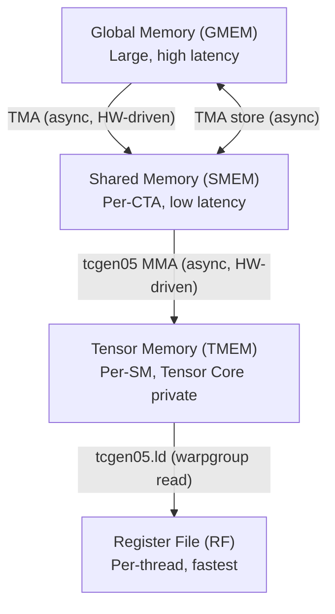
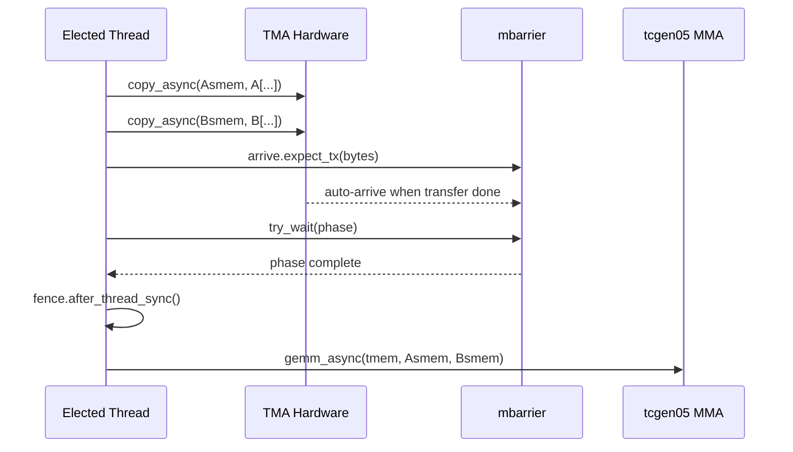
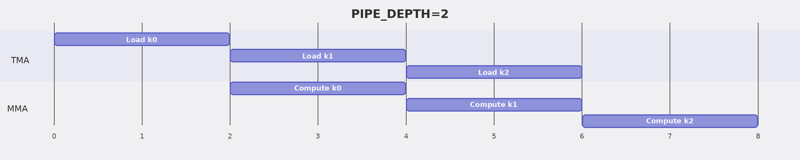
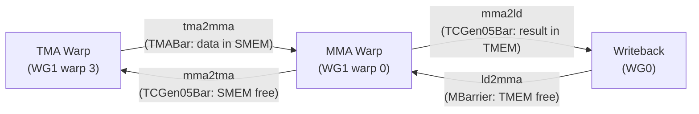
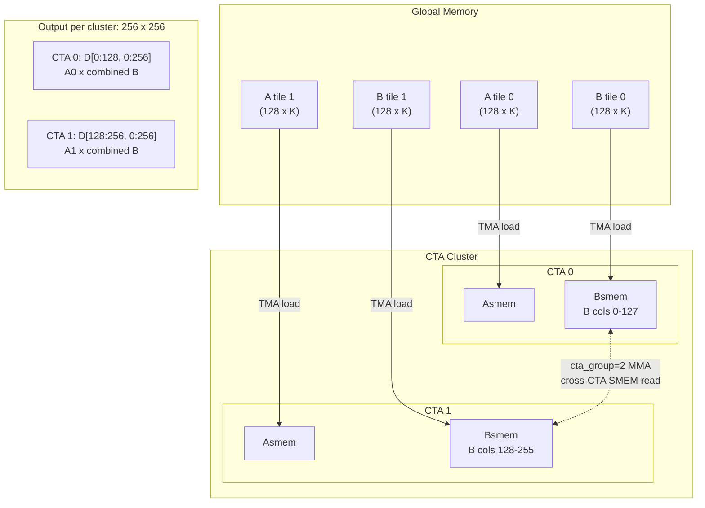

# Assignment: Blackwell GEMM Kernel Optimization

In this assignment, you will progressively build a high-performance FP16 GEMM kernel for NVIDIA Blackwell (SM100) GPUs using TVM/TIRX. Starting from a minimal single-tile kernel, you will incrementally add optimizations — K-loop accumulation, spatial tiling, TMA async loads, software pipelining, persistent kernels, warp specialization, deeper pipelines, multi-CTA clusters, and multi-consumer parallelism — until you arrive at a fully optimized kernel that matches the structure of production-grade implementations.

**Prerequisites**: Familiarity with CUDA programming concepts (threads, warps, shared memory, synchronization).

Please read the [slides](https://mlsyscourse.org/slides/tirx-gemm/) for the introduction and guidance to TIRX and this assignment. Reading and fully understanding them beforehand is **strongly recommended**, as they provide important context for the assignment.

---

## Background: Blackwell GPU Architecture

Before diving into the code, let's understand the key hardware features of NVIDIA Blackwell (SM100) GPUs that make high-performance GEMM possible. If you're familiar with CUDA, you already know about threads, warps, shared memory, and global memory. Blackwell introduces several new hardware units and memory spaces.

### Memory Hierarchy

Blackwell extends the traditional GPU memory hierarchy with new levels:



- **Tensor Memory (TMEM)** is new in Blackwell. It is a high-bandwidth scratchpad memory private to the Tensor Cores. The tcgen05 MMA unit writes its output directly to TMEM (not to registers or shared memory). To read the results, you must explicitly load from TMEM to the register file. Reading TMEM requires all 128 threads in a **warpgroup** (4 consecutive warps) to cooperate.

- **TMEM is not directly addressable** by normal instructions — it is accessed through a special 2D address space with rows (mapped to threads) and columns. TMEM must be explicitly allocated before use and deallocated afterward.

### TMA (Tensor Memory Accelerator)

TMA is a hardware unit that asynchronously copies rectangular tiles between global memory and shared memory (both load and store). Key advantages over manual data movement:

- **No thread involvement**: A single thread issues the TMA command; the hardware handles the actual data transfer in the background. Other threads don't need to participate.
- **Swizzled layouts**: TMA hardware automatically applies address swizzling during the transfer, ensuring bank-conflict-free access for Tensor Cores.
- **Byte counting**: TMA loads work with mbarriers — the programmer tells the barrier how many bytes to expect, and the hardware automatically signals it once that many bytes have been transferred. TMA stores use a separate completion mechanism (commit group + wait).

### tcgen05 (Tensor Core MMA)

`tcgen05` is Blackwell's matrix multiply-accumulate (MMA) unit. It reads A and B operands from shared memory and writes the result to tensor memory. Key properties:

- **Asynchronous**: The MMA instruction returns immediately; computation runs in the background.
- **Single-thread dispatch**: Only one elected thread per warp issues MMA and commit. Other threads do not participate.
- **Accumulation mode**: The MMA can either overwrite TMEM or add to existing values. The first iteration of a K-loop overwrites; subsequent iterations accumulate partial results.
- **Commit + mbarrier**: After issuing one or more MMAs, a commit groups them together. The hardware will signal the specified mbarrier when all MMAs in that group complete. The commit itself returns immediately — the mbarrier is signaled later when the hardware finishes.
- **cta_group**: Controls how many CTAs cooperate on a single MMA. With cta_group=2, only CTA-0 issues the MMA instruction, but the hardware reads B from **both** CTAs' shared memory via the cluster address space, producing a wider output (2x columns). Each CTA still loads its own A tile (different M rows).

### mbarrier (Memory Barrier)

mbarriers are hardware synchronization primitives stored in shared memory. They combine a counter with a phase bit to enable reusable, asynchronous synchronization.

**Lifecycle of an mbarrier:**

1. **Init**: Set the expected number of arrivals. The barrier starts at phase 0.
2. **Arrive**: Each arrival decrements the counter. There are three ways to arrive:
   - **TMA auto-arrive**: When you issue a TMA load targeting an mbarrier, the hardware arrives automatically once the byte transfer completes. You tell the barrier how many bytes to expect beforehand.
   - **tcgen05 auto-arrive**: When you commit a group of MMAs to an mbarrier, the hardware arrives once those MMAs complete.
   - **Thread arrive**: A thread arrives explicitly (used, e.g., by writeback threads to signal "TMEM is free").
3. **Wait**: Block until the barrier's current phase matches the expected phase — meaning all arrivals for that round have occurred.
4. **Phase flip**: Once all arrivals are done, the barrier automatically toggles its phase (0 → 1 → 0 → ...). This lets the same barrier be reused across loop iterations without confusion: iteration 0 uses phase 0, iteration 1 uses phase 1, iteration 2 uses phase 0 again, and so on. The caller tracks the expected phase and flips it after each wait.

This is the key to overlapping computation with memory transfers: TMA automatically arrives on a barrier when data is ready, and the MMA warp waits on that barrier before computing.

### Synchronization Rules

Blackwell has multiple asynchronous hardware units (threads, TMA, tcgen05 MMA) that read and write different memory spaces (GMEM, SMEM, TMEM, registers). Whenever data crosses from one unit or memory space to another, you need explicit synchronization to ensure the producer is done before the consumer reads. The general pattern is:

| Data flow | Synchronization needed |
|---|---|
| Threads write SMEM → MMA reads SMEM | `cta_sync()` (wait for all threads) + `fence.after_thread_sync()` (make SMEM visible to MMA hardware) |
| MMA writes TMEM → Threads read TMEM | `mbarrier.try_wait` (wait for MMA to complete) + `fence.after_thread_sync()` (make TMEM visible to subsequent reads) |
| Threads write SMEM → TMA reads SMEM (store) | `fence.proxy_async("shared::cta")` (flush SMEM writes) |
| Alloc barriers/TMEM → Use them | `fence.proxy_async` + `fence.mbarrier_init` + `cta_sync()` |
| All work done → Deallocate TMEM | `cta_sync()` for single-CTA kernels, `cluster_sync()` for cluster kernels. Ensures all CTAs are done before any CTA deallocates. |

The key insight: `cta_sync()` synchronizes **threads** with each other, but the MMA and TMA hardware operate independently from threads. Fences (`fence.after_thread_sync`, `fence.proxy_async`) bridge the gap between thread-visible memory and hardware-visible memory.

### CTA Clusters

Blackwell supports **CTA clusters** — groups of CTAs that can cooperate via:

- **shared::cluster memory**: CTAs in the same cluster can access each other's shared memory.
- **Multicast TMA**: A single TMA command can deliver the same data to multiple CTAs simultaneously, reducing global memory bandwidth.
- **Cross-CTA barrier signaling**: mbarrier arrive/wait across CTAs in the cluster.

For GEMM, clustering enables the MMA to cross-read B from both CTAs' shared memory, effectively doubling the output width without additional global memory bandwidth. This is used in steps 9-10.

---

## TIRX Primer

TIRX is an extended Tensor IR built on top of TVM. It provides a Python DSL for writing GPU kernels that map directly to hardware features. Here is a simplified sketch showing the key elements (not a complete kernel — synchronization and writeback are omitted):

```python
@Tx.prim_func(tirx=True)                    # Declare a TIRX primitive function
def kernel(A: Tx.Buffer((M, K), "float16"),  # Typed buffer parameters
           D: Tx.Buffer((M, N), "float16")):
    with Tx.kernel():                        # Kernel execution scope
        bx, by = Tx.cta_id([grid_m, grid_n], parent="kernel")  # CTA indices
        wg_id = Tx.warpgroup_id([1], parent="cta")             # Warpgroup index
        warp_id = Tx.warp_id([4], parent="warpgroup")          # Warp within WG
        lane_id = Tx.thread_id([32], parent="warp")            # Thread within warp

        pool = Tx.PoolAllocator()            # Shared memory allocator
        Asmem = pool.alloc((128, 64), "float16", layout=A_layout)
        pool.commit()                        # Finalize allocation

        Tx.copy(Asmem[:, :], A[...])         # Synchronous copy GMEM -> SMEM
        Tx.gemm_async(tmem, Asmem, Bsmem,    # Async MMA
                       accum=False, dispatch="tcgen05", cta_group=1)
```

Beyond what the sketch shows, you will need to learn:
- **Scope nesting**: `Tx.kernel()` > `Tx.cta()` > `Tx.warpgroup()` > `Tx.warp()` > `Tx.thread()` control which threads execute a block. For example, `Tx.copy` inside `with Tx.cta():` means all threads cooperate on the copy; inside `with Tx.thread():` means each thread copies independently.
- **`Tx.meta_var`**: Creates compile-time aliases for expressions (e.g., `m_st = Tx.meta_var(bx * 128)`). Use this when you need to pass a computed offset to buffer slicing.
- **`Tx.ptx.*`**: Direct access to PTX intrinsics — the hardware-level operations introduced in the Background section (mbarrier init/arrive/wait, tcgen05 alloc/commit, memory fences).
- **Layouts**: `tma_shared_layout(dtype, SwizzleMode, shape)` creates swizzled layouts for shared memory buffers. You don't need to understand swizzle internals — just pass this layout when allocating SMEM buffers that will be used with TMA or MMA.


### Axe Layout

These kernels use **Axe Layout** ([Hou et al., 2026](https://arxiv.org/abs/2601.19092)), a hardware-aware layout abstraction that maps logical tensor coordinates to named physical axes. Instead of manually computing memory addresses or thread-to-element mappings (as in raw CUDA), you declare a layout on each buffer and the compiler generates the correct address arithmetic, TMA descriptors, and TMEM load instructions automatically.

**Syntax.** The layout spec `S[shape : stride@axis]` reads as "map each dimension to a named hardware axis":

```python
S[(128, 512) : (1@TLane, 1@TCol)]
#  ^^^  ^^^     ^^^^^^^^  ^^^^^^^^
#  rows cols    row axis  col axis
# "128 rows on TLane, 512 cols on TCol"
```

If no `@axis` is given (just a plain number), it defaults to the memory axis `m`.

**Quick reference — layouts used in this kernel:**

| When you need... | Use this | Example buffers |
|---|---|---|
| Shared memory for TMA | `tma_shared_layout(dtype, SWIZZLE_128B_ATOM, shape)` | `Asmem`, `Bsmem`, `Dsmem` |
| TMEM buffer | `TileLayout(S[(128, 512) : (1@TLane, 1@TCol)])` | `tmem` |
| Register view for warpgroup TMEM read | `TileLayout(S[(128, N) : (1@axis_tid_in_wg, 1)])` | `Dreg_wg` |

- **SMEM layout**: `tma_shared_layout` creates a swizzled layout for bank-conflict-free access. You don't need to understand swizzle internals — just call this helper function with your dtype, swizzle mode, and buffer shape.
- **TMEM layout**: `TLane` and `TCol` are Blackwell Tensor Memory's native 2D addressing axes. Declaring this layout tells the compiler the buffer lives in TMEM.
- **Register view**: `axis_tid_in_wg` means "distribute rows across the 128 threads in a warpgroup." When you write `Tx.copy(Dreg_wg, tmem)`, the compiler matches `tid_in_wg` to `TLane` and generates the correct TMEM load instructions.


---

## Setup

### Modal Setup

1. Install Modal and authenticate with your Andrew email account:

```bash
pip install modal
modal setup
```

2. Run tests via Modal:

```bash
# Run all tests
modal run run_modal.py
# Run a specific step
modal run run_modal.py --step 3
# Run multiple specific steps
modal run run_modal.py --step 1,3,5
```

---

### Local Setup

#### Prerequisites

- **OS**: Linux (Ubuntu 20.04+ recommended)
- **GPU**: NVIDIA Blackwell (B200 / B100) with driver >= 570
- **Python**: >= 3.10 with `pip`

#### Install

```bash
python -m pip install --pre -U -f https://mlc.ai/wheels "mlc-ai-tirx-cu130==0.0.1b2"
pip install torch==2.9.1+cu130 --index-url https://download.pytorch.org/whl/cu130
pip install pytest numpy
```

#### Verify Installation

```bash
python -c "import tvm; print(tvm.__version__)"
python -c "from tvm.script import tirx as Tx; print('TIRX OK')"
```

Both commands should complete without errors.

#### GPU Selection

On multi-GPU machines, select an idle GPU to avoid conflicts with other users:

```bash
export CUDA_VISIBLE_DEVICES=$(nvidia-smi --query-gpu=index,memory.used --format=csv,noheader,nounits | sort -t',' -k2 -n | head -1 | cut -d',' -f1 | tr -d ' ')
```

The test framework (`conftest.py`) also auto-selects the least busy GPU if `CUDA_VISIBLE_DEVICES` is not set, but setting it explicitly is recommended.

If tests fail intermittently, check `nvidia-smi` — another process may be using the GPU. Switch to an idle one.

---

## File Structure

```
gemm_kernels.py          # Skeleton — your implementation goes here
utils.py                 # Helpers: prepare_data, compile_and_run, verify, benchmark
run_modal.py             # Run tests on cloud B200 via Modal
inspect_cuda.py          # View generated CUDA/PTX code for any step
tests/
  conftest.py            # Pytest GPU selection fixture
  test_step01.py         # Step 1 test
  ...
  test_step10.py         # Step 10 test
```

---

## How to Work

1. Open `gemm_kernels.py` and implement the `TODO` sections for each step.
2. Run the corresponding test to verify correctness:
   - **Via Modal (cloud B200):**
     ```bash
     modal run run_modal.py --step XX
     # or run multiple steps at once
     modal run run_modal.py --step 1,3,5
     ```
   - **Locally:**
     ```bash
     python -m pytest tests/test_stepXX.py -xvs
     ```
3. Move on to the next step only after the current one passes.
4. Steps are cumulative — each step builds on the previous one. Read the full step description before starting.

---

## Steps

### Step 1: Single-Tile Synchronous GEMM (Warm-up)

**What you will learn:**
- The basic structure of a TIRX kernel: function declaration, thread hierarchy, memory allocation
- Synchronous data loading (GMEM -> SMEM) and tcgen05 MMA invocation
- TMEM allocation/deallocation and writeback (TMEM -> RF -> GMEM)

**Background:**

This is the simplest possible GEMM: the matrix dimensions exactly match one hardware tile (M=128, N=128, K=64), so no tiling or looping is needed. The entire computation is: load A and B into shared memory, run one MMA, read the result from tensor memory to registers, and write to global memory.

The kernel structure is:

1. **Allocate shared memory**: Use `Tx.PoolAllocator()` to allocate `Asmem` (128x64), `Bsmem` (128x64), an mbarrier, and a TMEM address slot.
2. **Allocate TMEM**: `Tx.ptx.tcgen05.alloc(addr, n_cols=512, cta_group=1)` — only warp 0 does this.
3. **Fence + sync**: `fence.proxy_async("shared::cta")` flushes pending shared memory writes, `fence.mbarrier_init()` ensures the mbarrier initialization is visible, and `cta_sync()` synchronizes all threads (like `__syncthreads`). This sequence is needed after initializing barriers and TMEM so that all threads see the results before proceeding.
4. **Load data**: Use `with Tx.cta():` so all 128 threads cooperate on the copy. Then `cta_sync()` + `fence.after_thread_sync()` before MMA (see Synchronization Rules above).
5. **MMA**: Only warp 0's elected thread issues MMA and commit: `if warp_id == 0:` then `with Tx.thread(parent="warp")[Tx.ptx.elect_sync()]:`.
6. **Wait for MMA**: `Tx.ptx.mbarrier.try_wait(mma_bar, phase)`. Place this **outside** `if warp_id == 0:` — all threads must wait here, because the subsequent TMEM read requires all 128 threads in the warpgroup to participate after MMA completes.
7. **Writeback**: Two scopes:
   - `with Tx.warpgroup():` — read TMEM to registers (all 128 threads cooperate on TMEM load)
   - `with Tx.thread():` — cast fp32 -> fp16, then write to GMEM. Each of the 128 threads writes one row. A warpgroup has 4 warps of 32 threads, so thread's row is `m_st + warp_id * 32 + lane_id` (warp 0 handles rows 0-31, warp 1 handles rows 32-63, etc.).
8. **Deallocate TMEM**: `tcgen05.relinquish_alloc_permit` + `tcgen05.dealloc`.

**Implementation hints:**
- `accum=False` (not `0`) for the first MMA — TIRX requires a boolean.
- Register buffers: `Tx.alloc_local((BLK_N,), dtype)` allocates a 1D per-thread buffer. Use `.view(128, BLK_N, layout=...)` to create a 2D warpgroup view for TMEM reads.
- **Layouts** (see Axe Layout section above):
  - SMEM: `A_layout = tma_shared_layout(a_type, SwizzleMode.SWIZZLE_128B_ATOM, (BLK_M, BLK_K))`
  - TMEM: `TileLayout(S[(128, 512) : (1@TLane, 1@TCol)])`
  - Register view for writeback: `TileLayout(S[(128, BLK_N) : (1@axis_tid_in_wg, 1)])`

**Test:** `pytest tests/test_step01.py -xvs`

---

### Step 2: K-Loop Accumulation

**What you will learn:**
- Iterating over the K dimension with multiple MMA invocations
- The `accum` flag: `False` for the first K tile, `True` for subsequent tiles (accumulate into existing TMEM values)
- mbarrier phase flipping for repeated synchronization

**Background:**

Real matrices have K >> 64. To handle this, we loop over K in chunks of `BLK_K=64`. Each iteration loads a new (128x64) A tile and (128x64) B tile, then runs an MMA. The `accum` parameter tells the Tensor Core whether to overwrite TMEM (`False`) or add to it (`True`).

The mbarrier is reused across iterations. After each wait, the phase flips (0 -> 1 -> 0 -> ...) so the next wait doesn't immediately succeed on the old arrival.

**Implementation hints:**
- Loop: `for k in range(K_TILES)` where `K_TILES = K // BLK_K`.
- Load: `Tx.copy(Asmem, A[:, k*64:(k+1)*64])`.
- MMA: `accum = (k != 0)` — first iteration is False, rest are True.
- Phase flip: `phase_mma = phase_mma ^ 1` after each wait.

**Test:** `pytest tests/test_step02.py -xvs`

---

### Step 3: Spatial Tiling (Multi-CTA)

**What you will learn:**
- Launching a 2D grid of CTAs to cover arbitrary M and N dimensions
- Per-CTA tile offset calculation

**Background:**

Steps 1-2 only handle M=N=128. To support larger matrices, we launch a 2D grid of CTAs: `[M // BLK_M, N // BLK_N]`. Each CTA computes one 128x128 output tile.

CTA `(bx, by)` computes `D[bx*128 : (bx+1)*128, by*128 : (by+1)*128]` by loading `A[bx*128 : (bx+1)*128, :]` and `B[by*128 : (by+1)*128, :]`.

**Implementation hints:**
- `bx, by = Tx.cta_id([M // BLK_M, N // BLK_N], parent="kernel")`
- `m_st = Tx.meta_var(bx * BLK_M)`, `n_st = Tx.meta_var(by * BLK_N)`
- The K-loop body is the same as step 2, just with offset A and B slices.

**Test:** `pytest tests/test_step03.py -xvs`

---

### Step 4: TMA Async Load

**What you will learn:**
- Replacing synchronous `Tx.copy` with asynchronous TMA: `Tx.copy_async(..., dispatch="tma")`
- Single-thread TMA dispatch via `Tx.ptx.elect_sync()`
- mbarrier-based byte-counting synchronization: `arrive.expect_tx` / `try_wait`
- TMA store writeback: TMEM -> RF -> SMEM -> TMA store -> GMEM

**Background:**

Synchronous loads waste thread resources — all 128 threads sit idle while the memory controller fetches data. TMA offloads this entirely to hardware: one thread issues the command, and the TMA unit handles the rest asynchronously.

The synchronization flow is:



The `expect_tx` call tells the mbarrier how many bytes the TMA will transfer. When TMA finishes transferring exactly that many bytes, the barrier automatically transitions.

**Writeback with TMA store:**

Instead of writing directly from registers to GMEM (slow, uncoalesced), we use TMA store:
1. Read TMEM -> registers
2. Cast fp32 -> fp16 in registers
3. Write registers -> Dsmem (shared memory, with swizzled layout)
4. TMA store: `Tx.copy_async(D[...], Dsmem[:,:], dispatch="tma")` — one thread issues TMA store
5. Wait for TMA store completion: `Tx.ptx.cp_async.bulk.commit_group()` + `Tx.ptx.cp_async.bulk.wait_group(0)`

Note: TMA **loads** signal completion via mbarrier (byte counting). TMA **stores** use a different mechanism — commit group + wait group — because there is no consumer that needs to be notified; you just need to ensure the store finishes before reusing the Dsmem buffer.

This requires allocating a `Dsmem` buffer with a TMA-compatible swizzled layout (`tma_shared_layout` — same helper used for Asmem/Bsmem).

**Implementation hints:**
- Use `@Tx.inline` to define helper functions (e.g., `tma_load`, `mma`) inside the kernel. These are inlined at compile time and can capture outer variables like `Asmem`, `tma_bar`, etc.
- Only one thread issues TMA and MMA. You can use `if warp_id == 0:` with `elect_sync()` (as in step 1), or compute `tid = Tx.meta_var(warp_id * 32 + lane_id)` and use `with Tx.thread(parent="warpgroup")[tid == 0]:`.
- TMA config: `{"dispatch": "tma", "cta_group": 1, "mbar": tma_bar.ptr_to([0])}`
- Byte count: `(BLK_M * BLK_K + BLK_N * BLK_K) * 2` (fp16 = 2 bytes)
- Use `Tx.ptx.mbarrier.init(tma_bar.ptr_to([0]), 1)` — 1 expected arrival from the expect_tx call.


**Test:** `pytest tests/test_step04.py -xvs`

---

### Step 5: Software Pipeline (PIPE_DEPTH=2)

**What you will learn:**
- Overlapping TMA loads with MMA computation using double buffering
- Multi-buffered shared memory: `Asmem[stage, :, :]`
- Pipeline stage and phase tracking 
- Prefetch loop pattern

**Background:**

Without pipelining, the kernel alternates between loading and computing:


With a 2-stage pipeline, we overlap loading the next tile with computing the current one:



This requires double-buffered SMEM: `Asmem[0, :, :]` and `Asmem[1, :, :]`. While the MMA reads from stage 0, TMA loads into stage 1, and vice versa.

Each stage has its own mbarrier and phase counter. The pattern is:
1. **Prefetch**: Load the first `PRE_NUM` stages.
2. **Main loop**: For each K tile, wait for load to finish, compute, then issue the next load.

**Implementation hints:**
- `PIPE_DEPTH = 2`
- `Asmem = pool.alloc((PIPE_DEPTH, BLK_M, BLK_K), ...)`
- `tma_bar = pool.alloc((PIPE_DEPTH,), "uint64", ...)`
- Stage tracking: `stage = k % PIPE_DEPTH`
- Phase flips when stage wraps back to 0: `phase ^= 1`

**Test:** `pytest tests/test_step05.py -xvs`

---

### Step 6: Persistent Kernel + Tile Scheduler

**What you will learn:**
- Persistent kernel pattern: fixed number of CTAs that loop over tiles
- `ClusterPersistentScheduler2D` for L2-cache-friendly tile ordering
- Why persistent kernels improve performance

**Background:**

In steps 3-5, each CTA computes exactly one output tile, and the GPU launches `(M/128) * (N/128)` CTAs. For large matrices, this can mean thousands of CTAs, and the launch overhead + cold L2 cache hurt performance.

A persistent kernel launches exactly `SM_COUNT` CTAs (one per SM). Each CTA loops over multiple tiles using a tile scheduler:

```python
tile_scheduler = ClusterPersistentScheduler2D(
    "ts", num_m_tiles=M//128, num_n_tiles=N//128,
    l2_group_size=8, num_clusters=SM_COUNT)
tile_scheduler.init(bx)
while tile_scheduler.valid():
    # ... compute tile at (tile_scheduler.m_idx, tile_scheduler.n_idx) ...
    tile_scheduler.next_tile()
```

The scheduler orders tiles in an L2-cache-friendly pattern (processing nearby tiles together), which significantly improves memory bandwidth utilization.

**Implementation hints:**
- `bx = Tx.cta_id([SM_COUNT], parent="kernel")` — single-dimensional grid.
- `m_st = Tx.meta_var(tile_scheduler.m_idx * BLK_M)`.
- `n_st = Tx.meta_var(tile_scheduler.n_idx * BLK_N)`.
- The K-loop and pipeline logic remain the same as step 5.

**Test:** `pytest tests/test_step06.py -xvs`

---

### Step 7: Warp Specialization (PIPE_DEPTH=2)

**What you will learn:**
- Warp specialization: dedicating different warps/warpgroups to different tasks
- High-level barrier abstractions: `TMABar`, `TCGen05Bar`, `MBarrier`
- `PipelineState` for automatic stage/phase management
- The producer-consumer synchronization chain

**Background:**

This is the biggest architectural change. Instead of all threads doing load-then-compute sequentially, we dedicate specific warps to specific tasks:

- **WG1, warp 3**: TMA producer — continuously loads A and B tiles
- **WG1, warp 0**: MMA consumer — continuously runs MMA as soon as data is ready
- **WG0**: Writeback — reads results from TMEM and writes to GMEM

This requires four types of barriers to synchronize the three actors:



- **tma2mma** (`TMABar`): TMA signals MMA "data is in SMEM". TMA hardware auto-arrives via byte counting.
- **mma2tma** (`TCGen05Bar`): MMA signals TMA "SMEM can be reused". tcgen05 hardware auto-arrives via `commit`.
- **mma2ld** (`TCGen05Bar`): MMA signals writeback "results are in TMEM".
- **ld2mma** (`MBarrier`): Writeback signals MMA "TMEM is free for next tile". Threads arrive manually.

`PipelineState` manages stage indices and phase counters automatically:
```python
tma_phase = PipelineState("tma", PIPE_DEPTH)
tma_phase.init(is_producer=True)
# Use tma_phase.stage (current stage index) and tma_phase.phase (current phase)
tma_phase.move_to_next_stage()  # Advance to next stage
```

**`is_producer` controls the initial phase.** Barriers start at phase 0. `try_wait(bar, phase)` blocks until the barrier's phase equals the given phase.
- `is_producer=True` → initial phase = 1. The first `wait(stage, phase=1)` sees barrier phase 0 ≠ 1, so it **passes immediately** — the producer can write without waiting (buffers start empty).
- `is_producer=False` → initial phase = 0. The first `wait(stage, phase=0)` sees barrier phase 0 == 0, so it **blocks** — the consumer waits for the producer to fill data first.

Getting this wrong causes either deadlock (producer waits for consumer who waits for producer) or data corruption (consumer reads before producer writes).

`TCGen05Bar.arrive` takes a `cta_mask` parameter. For non-cluster kernels (single CTA), use `cta_mask=1`. For cluster kernels (step 9+), use `cta_mask=3` to multicast the signal to both CTAs.

**Epilogue (writeback) structure:**
1. Wait for MMA completion: `mma2ld.wait`, then `fence.after_thread_sync()` to make TMEM data visible
2. Read TMEM to registers (can be done in chunks to reduce register pressure)
3. Cast fp32 -> fp16, accumulate into `Dreg_16b`
4. Signal MMA that TMEM is free: `ld2mma.arrive`
5. Write `Dreg_16b` to `Dsmem`, then TMA store to GMEM. You can use a smaller `Dsmem` (e.g., `EPI_N=64` columns) and loop over chunks to save shared memory.

**Implementation hints:**
- `WG_NUMBER = 2`, `PIPE_DEPTH = 2`
- Barrier init counts: `tma2mma.init(1)`, `mma2tma.init(1)`, `mma2ld.init(1)`, `ld2mma.init(128)` (all 128 threads in writeback WG arrive)
- TMA warp uses `with Tx.thread(parent="warp")[Tx.ptx.elect_sync()]:` to elect one thread
- MMA warp similarly uses elect_sync
- Both run inside `while tile_scheduler.valid():` loops

**Test:** `pytest tests/test_step07.py -xvs`

---

### Step 8: Deeper Pipeline (PIPE_DEPTH=4)

**What you will learn:**
- The effect of pipeline depth on latency hiding
- How to scale the warp-specialized structure to more pipeline stages

**Background:**

Step 7 uses `PIPE_DEPTH=2` (double buffering). With only 2 stages, the TMA producer can be at most 1 stage ahead of the MMA consumer. If the TMA latency is longer than the MMA compute time, the MMA warp stalls waiting for data.

With `PIPE_DEPTH=4`, the TMA producer can be up to 3 stages ahead, providing more buffering to absorb latency variations. The cost is more shared memory (4x the A/B buffers instead of 2x) and more barrier instances.

**Changes from step 7:**
- `PIPE_DEPTH = 4` (was 2)
- `TMABar(pool, 4, ...)`, `TCGen05Bar(pool, 4, ...)`
- `Asmem = pool.alloc((4, BLK_M, BLK_K), ...)`
- `PipelineState("tma", 4)`, `PipelineState("mma", 4)`

Everything else — the warp specialization structure, barrier flow, and epilogue — remains identical.

**Test:** `pytest tests/test_step08.py -xvs`

---

### Step 9: 2-CTA Cluster

**What you will learn:**
- CTA clusters: multiple CTAs cooperating on a larger tile
- Cross-CTA SMEM access: `cta_group=2` MMA reads B from both CTAs
- Cross-CTA barrier signaling with `cta_mask`
- `cta_group=2` for wider MMA output (MMA_N = BLK_N * CTA_GROUP = 256)

**Background:**

With clustering, two CTAs form a cooperative group. Each CTA has its own shared memory, but they can access each other's SMEM via the `shared::cluster` address space.

The key optimization: with `cta_group=2`, the MMA hardware can read B from **both** CTAs' shared memory via the `shared::cluster` address space. Each CTA loads only 128 columns of B into its own SMEM, but the MMA sees all 256 columns across both CTAs. This doubles the output width without additional memory bandwidth.



Although only CTA-0's elected thread issues the MMA instruction, **both CTAs' Tensor Cores compute simultaneously**. Each CTA reads A from its own SMEM (different M rows). For B, both CTAs' SMEM is mapped into a shared `shared::cluster` address space — the MMA hardware reads B from both CTAs' SMEM at the same offset, concatenating them into 256 columns. Each CTA produces a 128 x 256 output in its own TMEM, and the cluster tile is 256 x 256.

**New concepts:**
- **Cluster CTA ID**: `cbx, cby = Tx.cta_id([CTA_GROUP, 1], parent="cluster")` — position within the cluster.
- **Kernel CTA ID**: `bx = Tx.cta_id([SM_COUNT], parent="kernel")` — which SM.
- **Remote barrier view**: `tma2mma_cta0 = tma2mma.remote_view(0)` — access CTA-0's barrier from any CTA.
- **MMA only on CTA-0**: `if cbx == 0:` — only CTA-0's warp 0 issues MMA commands.
- **Multicast arrive**: `mma2tma.arrive(stage, cta_group=2, cta_mask=3)` — signal both CTAs.
- **TMA arrive only from CTA-0**: `if cbx == 0: tma2mma_cta0.arrive(stage, bytes)`.
- **cluster_sync** instead of **cta_sync** at the end.

**MMA output width:**
With `cta_group=2`, `Tx.gemm_async` outputs `MMA_N = BLK_N * CTA_GROUP = 256` columns (not 128). The epilogue must handle 256 columns of output.

**Implementation hints:**
- `CTA_GROUP = 2`, `MMA_N = BLK_N * CTA_GROUP`
- `m_st` and `n_st` account for cluster position (cbx)
- `ld2mma.init(128 * CTA_GROUP)` — both CTAs' writeback WGs arrive
- Tile scheduler: `num_m_tiles=M//256`, `num_n_tiles=N//256`, `num_clusters=SM_COUNT//2`, `tile_scheduler.init(bx // CTA_GROUP)`
- `tcgen05.alloc` and `tcgen05.dealloc` must use `cta_group=2`
- TMA arrive byte count must include both CTAs: `CTA_GROUP * (BLK_M * BLK_K + BLK_N * BLK_K) * DTYPE_SIZE`

**Test:** `pytest tests/test_step09.py -xvs`

---

### Step 10: Multi-Consumer Warp Specialization (Final Kernel)

**What you will learn:**
- Multiple MMA warps (consumers) for higher throughput
- Multiple writeback warpgroups
- How the reference production kernel is structured

**Background:**

The final optimization adds a second MMA consumer. With `NUM_CONSUMER=2` and `WG_NUMBER=3`:

- **WG2**: Producer warpgroup
  - warp 0: MMA consumer 0 — computes `A[0:128, :] x B` -> TMEM columns `[0:256]`
  - warp 1: MMA consumer 1 — computes `A[128:256, :] x B` -> TMEM columns `[256:512]`
  - warp 3: TMA producer — loads 2x A blocks + 1x B block per stage
- **WG0**: Writeback for consumer 0 (reads TMEM `[0:256]`)
- **WG1**: Writeback for consumer 1 (reads TMEM `[256:512]`)

This doubles the compute density per CTA: each CTA now processes a 256x256 output tile (vs 128x256 in step 9), and the cluster output becomes 512x256 (vs 256x256 in step 9).

**Changes from step 9:**
- `WG_NUMBER = 3`, `NUM_CONSUMER = 2`
- `Asmem = pool.alloc((PIPE_DEPTH, NUM_CONSUMER, BLK_M, BLK_K), ...)` — 2 A blocks per stage
- TMA loads both `Asmem[stage, 0, :, :]` and `Asmem[stage, 1, :, :]`
- MMA warp `warp_id` selects which A block: `Asmem[stage, warp_id, :, :]`
- MMA output offset: `tmem[:, warp_id * MMA_N : warp_id * MMA_N + MMA_N]`
- Writeback WG offset: `wg_id * MMA_N`
- `mma2tma.init(NUM_CONSUMER)` — each stage expects 2 arrivals (one per MMA warp)
- `mma2ld = TCGen05Bar(pool, NUM_CONSUMER, ...)` and `ld2mma = MBarrier(pool, NUM_CONSUMER, ...)` — one shared object each with `depth=NUM_CONSUMER` (2 slots), **not** separate objects per consumer. Use `warp_id` / `wg_id` as the slot index (not `PipelineState.stage`): `mma2ld.arrive(warp_id, ...)`, `mma2ld.wait(wg_id, ...)`
- `mma2ld.init(1)` — each slot expects 1 arrival (one MMA warp)
- `ld2mma.init(128 * CTA_GROUP)` — each slot expects 256 arrivals (all writeback WG threads across both CTAs)
- Writeback **must** use chunked EPI_N (e.g., 64 or smaller) — reading all 256 TMEM columns at once exceeds register capacity
- Tile scheduler: `num_m_tiles=M // 256 // NUM_CONSUMER` — cluster tile is now 512x256
- TMA arrive bytes: `CTA_GROUP * (NUM_CONSUMER * BLK_M * BLK_K + BLK_N * BLK_K) * DTYPE_SIZE` — 2 A blocks + 1 B block per CTA
- Writeback uses `warpgroup_sync(wg_id + 10)` — each WG needs its own barrier ID. Using the same ID (e.g., `warpgroup_sync(10)`) for both WG0 and WG1 mixes their threads on a single barrier, causing partial writes and deadlocks at large sizes. This is something you should watch out for carefully.

**Test:** `pytest tests/test_step10.py -xvs`

---

## TIRX API Reference

### Thread Hierarchy

| API | Description |
|-----|-------------|
| `Tx.prim_func(tirx=True)` | Declare a TIRX primitive function |
| `Tx.kernel()` | Kernel execution scope |
| `with Tx.cta():` | Scope: all threads in the CTA execute this block |
| `with Tx.warpgroup():` | Scope: all 128 threads in the warpgroup execute this block |
| `with Tx.warp():` | Scope: all 32 threads in the warp execute this block |
| `with Tx.thread():` | Scope: each thread executes independently |
| `with Tx.thread(parent="warp")[cond]:` | Scope: only threads where `cond` is true execute |
| `Tx.cta_id(shape, parent=...)` | CTA index in grid or cluster |
| `Tx.warpgroup_id(shape, parent=...)` | Warpgroup index within CTA |
| `Tx.warp_id(shape, parent=...)` | Warp index within warpgroup |
| `Tx.thread_id(shape, parent=...)` | Thread (lane) index within warp |
| `Tx.ptx.elect_sync()` | Elect one thread in a warp (for single-thread dispatch) |

### Memory

| API | Description |
|-----|-------------|
| `Tx.PoolAllocator()` | Shared memory pool allocator |
| `pool.alloc(shape, dtype, layout=...)` | Allocate buffer from pool |
| `pool.move_base_to(offset)` | Set next allocation offset (for overlapping buffers) |
| `pool.commit()` | Finalize all allocations |
| `Tx.alloc_local(shape, dtype)` | Allocate per-thread register buffer |
| `buf.view(shape, layout=...)` | Create a view of a register buffer with a different layout |
| `Tx.decl_buffer(shape, dtype, scope="tmem", ...)` | Declare a TMEM buffer |
| `Tx.address_of(buf)` | Get address of a buffer (used for TMEM alloc) |
| `buf.ptr_to([idx])` | Get pointer to the idx-th element (used for mbarrier access) |
| `tma_shared_layout(dtype, SwizzleMode, shape)` | Create TMA-compatible swizzled layout for SMEM buffers |
| `Tx.ptx.tcgen05.alloc(addr, n_cols, cta_group)` | Allocate TMEM |
| `Tx.ptx.tcgen05.relinquish_alloc_permit(cta_group)` | Release TMEM allocation permit (call before dealloc) |
| `Tx.ptx.tcgen05.dealloc(addr, n_cols, cta_group)` | Deallocate TMEM |

### Data Movement

| API | Description |
|-----|-------------|
| `Tx.copy(dst, src)` | Synchronous copy |
| `Tx.copy_async(dst, src, dispatch="tma", ...)` | TMA async copy (load or store) |
| `Tx.cast(dst, src)` | Element-wise type cast |
| `Tx.gemm_async(C, A, B, accum, dispatch="tcgen05", cta_group)` | tcgen05 MMA |

### Control Flow

| API | Description |
|-----|-------------|
| `for i in Tx.unroll(N):` | Explicit unrolled loop with `i` usable for buffer slicing |
| `for i in Tx.serial(N):` | Sequential loop (not unrolled), `i` is a TIR variable |
| `Tx.meta_var(expr)` | Compile-time alias for an expression (required for buffer slice offsets) |
| `@Tx.inline` | Decorator for inline helper functions within the kernel |

### Synchronization

| API | Description |
|-----|-------------|
| `Tx.ptx.mbarrier.init(ptr, count)` | Initialize mbarrier with expected arrival count |
| `Tx.ptx.mbarrier.try_wait(ptr, phase)` | Wait for mbarrier phase |
| `Tx.ptx.mbarrier.arrive.expect_tx(ptr, bytes)` | Set expected TMA byte count |
| `Tx.ptx.tcgen05.commit(ptr, cta_group, cta_mask)` | tcgen05 commit (auto-arrive on completion) |
| `Tx.ptx.tcgen05.fence.after_thread_sync()` | Fence before accessing TMEM after sync |
| `Tx.ptx.fence.proxy_async("shared::cta")` | Shared memory fence |
| `Tx.ptx.fence.mbarrier_init()` | Fence after mbarrier initialization |
| `Tx.ptx.cp_async.bulk.commit_group()` | Commit pending TMA store operations |
| `Tx.ptx.cp_async.bulk.wait_group(n)` | Wait until at most `n` TMA store groups remain in flight |
| `Tx.cuda.cta_sync()` | CTA-wide barrier (like `__syncthreads`) |
| `Tx.cuda.warpgroup_sync(barrier_id)` | Warpgroup-level barrier (barrier_id differentiates multiple barriers) |
| `Tx.cuda.cluster_sync()` | Cluster-wide barrier |

### High-Level Abstractions

| API | Description |
|-----|-------------|
| `TMABar(pool, depth, name)` | TMA barrier array (auto-arrive via byte counting) |
| `TCGen05Bar(pool, depth, name)` | tcgen05 barrier array (auto-arrive via commit) |
| `MBarrier(pool, depth, name)` | Manual mbarrier array (threads arrive explicitly) |
| `bar.init(count)` | Initialize barrier with expected arrival count |
| `bar.wait(stage, phase)` | Wait for barrier at given stage and phase |
| `TMABar.arrive(stage, bytes)` | Arrive with expected byte count (TMA load) |
| `TCGen05Bar.arrive(stage, cta_group=, cta_mask=)` | Arrive via tcgen05 commit |
| `MBarrier.arrive(stage, cta_id=, pred=)` | Thread-level arrive |
| `bar.ptr_to([stage])` | Get pointer to barrier at given stage |
| `TMABar.remote_view(cta_id)` | Access another CTA's barrier (for cross-CTA signaling) |
| `PipelineState(name, depth)` | Manages pipeline stage index and phase |
| `PipelineState.init(is_producer=)` | Initialize phase tracking (producer starts ready, consumer starts waiting) |
| `PipelineState.stage` / `.phase` | Current stage index and phase value |
| `PipelineState.move_to_next_stage()` | Advance to next pipeline stage |
| `ClusterPersistentScheduler2D(...)` | L2-friendly tile scheduler for persistent kernels |

---

## Common Pitfalls

- **Do NOT use Python `and`/`or` on TIR expressions** (e.g., `warp_id == 0 and lane_id == 0`). These are Python operators that don't work on symbolic TIR variables. Use nested `if` statements instead.
- **`accum` must be boolean-compatible**: Use `False` (not `0`) for the first MMA iteration.
- **Fence API**: Use `Tx.ptx.fence.proxy_async("shared::cta")` — positional argument, not keyword `scope=`.
- **GPU flakiness**: If tests fail intermittently, check `nvidia-smi` and switch to an idle GPU.
- **Dsmem overlap**: `pool.move_base_to(1024)` before Dsmem allows it to overlap with Asmem/Bsmem (reusing memory after MMA is done).
- **Do NOT call `cta_sync()` inside an elected-thread scope** (e.g., inside `Tx.thread()[elect_sync()]`). Only one thread is executing — `cta_sync()` requires all threads to participate, so it will deadlock.
- **`alloc_local` vs `decl_buffer`**: Use `Tx.alloc_local` for register buffers. `Tx.decl_buffer` is only for hardware-managed memory like TMEM. To do cross-thread operations, create a view with `.view()` — but use the original `alloc_local` buffer (not the view) for thread-level operations like `Tx.cast`.
- **TMA store must be followed by `commit_group()` + `wait_group(0)`**: TMA store is asynchronous — without waiting, the next loop iteration may overwrite Dsmem before the store finishes reading it.
- **`fence.after_thread_sync()` required before reading TMEM**: After `mma2ld.wait()` (or any mbarrier wait), you must call `fence.after_thread_sync()` before reading TMEM. Without it, the TMEM data from MMA may not be visible to the reading threads.
- **Constants must be defined outside `@Tx.prim_func`**: Variables like `EPI_N`, `TMEM_LD_N`, `MMA_N` must be Python constants defined alongside `BLK_M`, `BLK_K`, etc. Variables assigned inside the kernel function become TIR dynamic variables, which causes errors when used in buffer slicing.

---

## Debugging: Inspect Generated CUDA Source

Use `inspect_cuda.py` to view the CUDA code the compiler generates from your TIRX kernel. This is the most effective way to debug deadlocks, crashes, and wrong results — it shows you exactly which threads execute which instructions.

### Basic Usage (via Modal)

Use Modal to compile on a cloud B200 — no local GPU required:

```bash
modal run run_modal.py --inspect 7              # Step 7, size 1024 (default)
modal run run_modal.py --inspect 9 --size 2048  # Step 9, size 2048
modal run run_modal.py --inspect 7 > v7.cu      # Save to file

# Search for specific instructions:
modal run run_modal.py --inspect 7 | grep tcgen05_alloc
modal run run_modal.py --inspect 7 | grep mbarrier_init
modal run run_modal.py --inspect 7 | grep -B5 -A5 "tcgen05_alloc"
```

If you have a local Blackwell GPU with the TIRX wheel installed, you can also run directly:

```bash
python inspect_cuda.py 7
python inspect_cuda.py 9 2048
```

### Reading the Generated Code

The generated CUDA kernel starts with a function like:

```c
__global__ void __launch_bounds__(256) kernel_kernel(...) {
  // warp_id_in_cta: 0-7 for 2 warpgroups × 4 warps
  int warp_id_in_cta = __shfl_sync(0xffffffff, (((int)threadIdx.x) >> 5), 0, 32);
  extern __shared__ uchar s_buf_w_offset_ptr[];  // shared memory pool
  ...
```

Key mappings from TIRX to generated CUDA:

| TIRX | Generated CUDA |
|------|---------------|
| `wg_id == 0` | `(warp_id_in_cta >> 2) == 0` |
| `wg_id == 1` | `(warp_id_in_cta >> 2) == 1` |
| `warp_id == 0` | `(warp_id_in_cta % 4) == 0` or `(warp_id_in_cta & 3) == 0` |
| `warp_id == 3` | `(warp_id_in_cta & 3) == 3` |
| `lane_id == 0` | `(((int)threadIdx.x) % 32) == 0` |
| `.init()` internal guard | `((int)threadIdx.x) < 1` (absolute CTA thread 0) |
| `elect_sync()` | `tvm_builtin_elect_one_sync_op()` |

### Example: Correct Step 7 Structure

A correctly compiled Step 7 kernel has this structure (from the reference implementation):

```c
// ---- Barrier inits: threadIdx.x < 1 guard (CTA thread 0 only) ----
if (((int)threadIdx.x) < 1) {
  tvm_builtin_ptx_mbarrier_init(&s_buf[4], 1);   // tma2mma slot 0
  tvm_builtin_ptx_mbarrier_init(&s_buf[5], 1);   // tma2mma slot 1
}
if (((int)threadIdx.x) < 1) {
  tvm_builtin_ptx_mbarrier_init(&s_buf[6], 1);   // mma2tma slot 0
  tvm_builtin_ptx_mbarrier_init(&s_buf[7], 1);   // mma2tma slot 1
}
if (((int)threadIdx.x) < 1) {
  tvm_builtin_ptx_mbarrier_init(&s_buf[8], 1);   // mma2ld
}
if (((int)threadIdx.x) < 1) {
  tvm_builtin_ptx_mbarrier_init(&s_buf[9], 128); // ld2mma
}

// ---- TMEM alloc: WG0 warp0 (all 32 lanes, no lane guard) ----
if ((warp_id_in_cta >> 2) == 0) {       // wg_id == 0
  if ((warp_id_in_cta % 4) == 0) {      // warp_id == 0
    tvm_builtin_ptx_tcgen05_alloc_cta_group_1(&s_buf[0], 512);
  }
}

// ---- Fences + sync ----
tvm_builtin_ptx_fence_proxy_async_shared_cta();
tvm_builtin_ptx_fence_mbarrier_init();
tvm_builtin_cuda_cta_sync();

// ---- Pipeline phase init ----
tma_phase_ptr[0] = 1;     // producer: starts at phase 1 (first wait passes)
mma_phase_ptr[0] = 0;     // consumer: starts at phase 0 (first wait blocks)
ld_phase_ptr[0] = 1;      // producer
wb_phase_ptr[0] = 0;      // consumer

// ---- WG1: TMA warp (warp 3) ----
if ((warp_id_in_cta >> 2) == 1) {       // wg_id == 1
  if ((warp_id_in_cta & 3) == 3) {      // warp_id == 3
    if (tvm_builtin_elect_one_sync_op()) {
      while (valid) {
        for (int k = 0; k < 16; ++k) {  // K_TILES iterations
          mbarrier_wait(mma2tma[stage], phase);   // wait for SMEM free
          cp_async_bulk_tensor(Asmem[stage], ...); // TMA load A
          cp_async_bulk_tensor(Bsmem[stage], ...); // TMA load B
          mbarrier_arrive_expect_tx(tma2mma[stage], 32768); // signal MMA
          stage = (stage + 1) % 2;
          if (stage == 0) phase ^= 1;
        }
        next_tile();
      }
    }
  } else {
    // ---- WG1: MMA warp (warp 0) ----
    if ((warp_id_in_cta % 4) == 0) {    // warp_id == 0
      if (tvm_builtin_elect_one_sync_op()) {
        while (valid) {
          mbarrier_wait(ld2mma, ld_phase);         // wait for TMEM free
          for (int k = 0; k < 16; ++k) {           // K_TILES iterations
            mbarrier_wait(tma2mma[stage], phase);   // wait for data
            tcgen05_fence_after_thread_sync();
            tcgen05_mma(...);                       // MMA
            tcgen05_commit(mma2tma[stage]);          // signal TMA
            stage = (stage + 1) % 2;
            if (stage == 0) phase ^= 1;
          }
          tcgen05_commit(mma2ld);                   // signal writeback
          next_tile();
        }
      }
    }
  }
} else {
  // ---- WG0: Writeback ----
  if ((warp_id_in_cta >> 2) == 0) {     // wg_id == 0
    while (valid) {
      mbarrier_wait(mma2ld, wb_phase);             // wait for MMA done
      tcgen05_ld(...);                              // read TMEM → registers
      mbarrier_arrive_remote(ld2mma, 0, true);     // signal MMA: TMEM free
      // ... cast, write to Dsmem, TMA store ...
      next_tile();
    }
  }
}

// ---- Cleanup ----
cta_sync();
if ((warp_id_in_cta % 4) == 0) {       // warp_id == 0 (all 32 lanes)
  tcgen05_relinquish_alloc_permit();
  tcgen05_dealloc(s_buf[0], 512);
}
```

### Debugging Deadlocks

**Step 1: Confirm it's a deadlock (not a crash)**

```bash
# Deadlock: hangs for ~30s then "unspecified launch failure"
# Crash (XID 43): fails instantly
CUDA_LAUNCH_BLOCKING=1 python -m pytest tests/test_step07.py -xvs -k "1024"
```

**Step 2: Reduce to smallest failing size**

If 1024 passes but 2048+ deadlocks, the bug likely involves pipeline state drift across tiles.

**Step 3: Verify barrier arrival counts match init counts**

| Barrier | `init(count)` | Who arrives | How many |
|---------|---------------|-------------|----------|
| `tma2mma` (TMABar) | `init(1)` | TMA warp via `arrive(stage, bytes)` | 1 |
| `mma2tma` (TCGen05Bar) | `init(1)` | MMA warp via `arrive(stage, cta_group, cta_mask)` | 1 |
| `mma2ld` (TCGen05Bar) | `init(1)` | MMA warp via `arrive(0, cta_group, cta_mask)` | 1 |
| `ld2mma` (MBarrier) | `init(128)` | All WG0 threads via `arrive(0, cta_id, pred)` | 128 |

Common mistakes:
- `ld2mma.init(128)` but `arrive` guarded by `if warp_id == 0: if lane_id == 0:` → only 1 arrival
- Step 10: `mma2ld.init(NUM_CONSUMER)` when each slot only gets 1 arrival → should be `init(1)`

**Step 4: Check barrier inits actually execute**

The `.init()` wrapper uses `threadIdx.x < 1` internally. If you nest it inside `if wg_id == 1:`, no thread satisfies both conditions. Generate code and verify:

```bash
python inspect_cuda.py 7 | grep -B10 "mbarrier_init"
```

Buggy code produces:
```c
if ((warp_id_in_cta >> 2) == 1) {     // wg_id == 1 → threadIdx 128-255
  if ((warp_id_in_cta % 4) == 0) {
    if (((int)threadIdx.x) < 1) {      // threadIdx.x < 1 → only thread 0
      mbarrier_init(...);              // NEVER REACHED — thread 0 is in WG0!
    }
  }
}
```

Correct code produces:
```c
if (((int)threadIdx.x) < 1) {         // at top level, no wg_id guard
  mbarrier_init(...);                  // thread 0 executes this
}
```

**Step 5: Verify TMA and MMA iterate the same number of K tiles**

```bash
python inspect_cuda.py 7 | grep "for (int k"
```

Both loops must show `k < 16` (for K=1024). If MMA shows `k < 15` (`K_TILES - 1`), the barrier phases drift and the second tile deadlocks.

**Step 6: Check `tcgen05.alloc/dealloc` have all 32 lanes participating**

```bash
python inspect_cuda.py 7 | grep -B5 "tcgen05_alloc"
```

Buggy code:
```c
if ((warp_id_in_cta % 4) == 0) {    // warp guard — OK
  if (((int)threadIdx.x) % 32 == 0) { // lane guard — WRONG, only 1 thread
    tcgen05_alloc(...);
  }
}
```

Correct code:
```c
if ((warp_id_in_cta >> 2) == 0) {    // wg guard
  if ((warp_id_in_cta % 4) == 0) {   // warp guard — all 32 lanes execute
    tcgen05_alloc(...);               // no lane guard
  }
}
```

### Debugging Crashes (XID 43 / Illegal Memory Access)

The kernel corrupts the CUDA context, so subsequent CUDA calls (even `torch.randn`) fail.

**Common causes:**

1. **`pool.alloc` after `pool.commit()`** — buffer has invalid SMEM address.
    ```bash
    grep -n "pool\.\|commit\|TMABar\|TCGen05Bar\|MBarrier" gemm_kernels.py
    ```

2. **`tcgen05.alloc/dealloc` with single-thread guard** — see Step 6 above.

3. **Missing `cta_sync()` before `tcgen05.dealloc`** — TMEM freed while writeback still reading. Check the generated code ends with:
    ```c
    tvm_builtin_cuda_cta_sync();           // all threads sync first
    if ((warp_id_in_cta % 4) == 0) {       // then dealloc
      tcgen05_relinquish_alloc_permit();
      tcgen05_dealloc(...);
    }
    ```

### Debugging Wrong Results

Specific mismatch counts (128, 253, 381) indicate synchronization bugs, not arithmetic errors. 128 = one thread's worth of output (one row of a 128-wide tile).

**Common causes:**

1. **Missing `cta_sync()` before `fence.after_thread_sync()`** (Steps 4–6): other threads read TMEM before MMA finishes.
2. **Missing `fence.proxy_async("shared::cta")` before TMA store**: TMA engine doesn't see SMEM writes.
3. **Missing `cp_async.bulk.commit_group()` / `wait_group(0)` after TMA store**: store doesn't complete before SMEM is reused.

---

## Performance Evaluation

GEMM performance is measured in TFLOPS (Tera Floating-Point Operations Per Second):

```
TFLOPS = 2 * M * N * K / (time_in_seconds) / 1e12
```

The factor of 2 accounts for the multiply and add in each fused multiply-add (FMA) operation.

Use the `benchmark` function in `utils.py` to measure your kernel's performance:

```python
from utils import benchmark
from gemm_kernels import hgemm_v10

kernel = hgemm_v10(4096, 4096, 4096)
ms, tflops = benchmark(kernel, 4096, 4096, 4096)
print(f"{ms:.3f} ms, {tflops:.1f} TFLOPS")
```

---

## Grading Rubric

Total: **100 points**. Each step is graded on correctness, performance (within a bound), and implementation.

| Step | Description | Points |
|------|-------------|--------|
| 1 | Single-tile synchronous GEMM | 5 |
| 2 | K-loop accumulation | 5 |
| 3 | Spatial tiling (multi-CTA) | 10 |
| 4 | TMA async load + TMA store | 10 |
| 5 | Software pipeline (PIPE_DEPTH=2) | 10 |
| 6 | Persistent kernel + tile scheduler | 10 |
| 7 | Warp specialization (PIPE_DEPTH=2) | 15 |
| 8 | Deeper pipeline (PIPE_DEPTH=4) | 5 |
| 9 | 2-CTA cluster | 15 |
| 10 | Multi-consumer (final kernel) | 15 |
| **Total** | | **100** |

---

## Submission

Please follow the instructions carefully.

### What is graded

Each step is graded on two criteria:

1. **Correctness** — the kernel output must match cuBLAS reference (within `rtol=1e-3, atol=1e-2`).
2. **Performance** — the kernel must achieve reasonable TFLOP/s compared to the reference implementation. Kernels significantly slower than the reference will fail the performance check.

### Create submission archive

From your assignment root directory, run:

```bash
tar cvf handin.tar gemm_kernels.py
```

You can verify the contents with:

```bash
tar tvf handin.tar
```

It should list exactly one file:

```
-rw-rw-r-- ... gemm_kernels.py
```

### Submission

**Note: Submissions are not open yet. We will provide the submission details later this week.**
